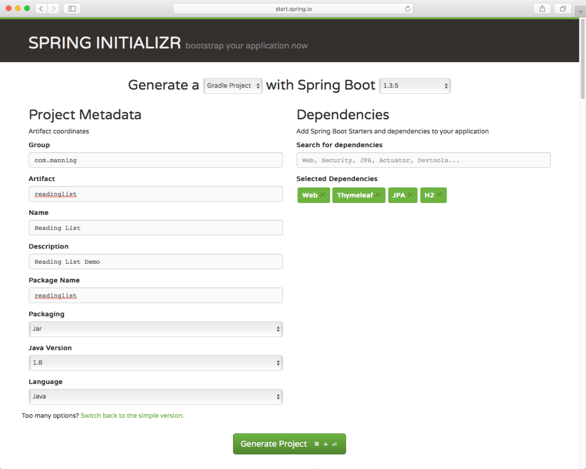
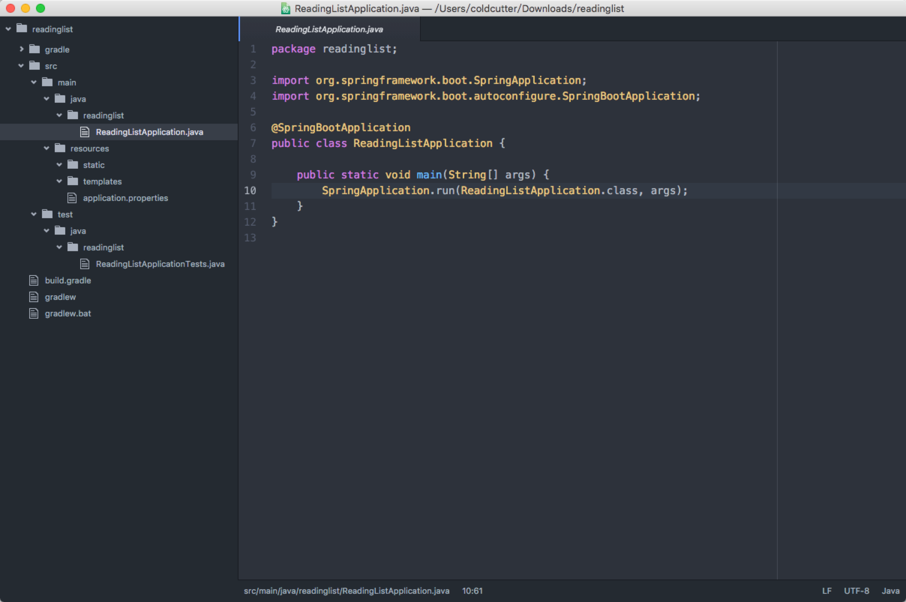

# 2 开发第一个应用

从本章开始，我们要开发一个简单的reading-list应用，用来维护一个reading-list，包括录入书的信息，查看阅读列表，删除书等操作。

技术上，Spring MVC处理Web请求，Thymeleaf作为模板引擎编写页面，Spring Data JPA操作数据库，使用内置H2数据库，用Gradle管理项目。

使用Spring Initializer生成



生成的项目结构



项目结构符合Gradle或者Maven的一般规范：

* 主代码位于/src/main/java
* 主资源位于/src/main/resources
* 测试代码位于/src/test/java
* 测试资源位于/src/test/resources

ReadingListApplication类有两个作用：主配置类和启动类。尽管Spring Boot自动配置特性能减少许多配置，但是至少需要有一个配置类来激活自动配置，@SpringBootApplication注解组合了其他三个有用的注解：

* Spring的@Configuration注解，指派该类成为配置类
* Spring的@ComponentScan注解，激活组件扫描功能，因此Web控制器类（@Controller）以及其他组件（如@Component，@Service等）可以自动注册为Spring application context中的beans
* Spring Boot的@EnableAutoConfiguration注解，激活自动配置

如何运行呢？有三种方法：

**1. 直接运行**

如果你在IDEA里，直接右键ReadingListApplication.java，点击Run就可以运行了（多亏了main函数）

**2. bootRun**

使用Spring Boot Gradle Plugin提供的bootRun task：

```
gradle bootRun
```

**3. 打包运行**

```
gradle build
java -jar build/libs/readinglist-0.0.1-SNAPSHOT.jar
```

正常情况下应用启动，访问localhost:8080，不过目前还没有Controller，所以会是HTTP 404 Not Found

注：如果有其他的配置，建议放到其他的@Configuration配置类中，独立于ReadingListApplication类