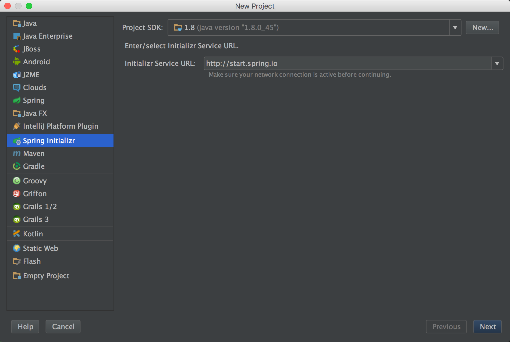
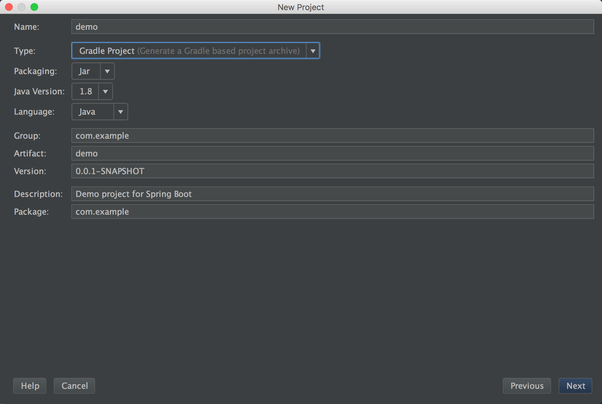
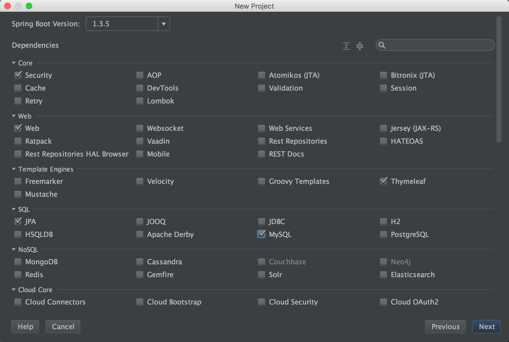
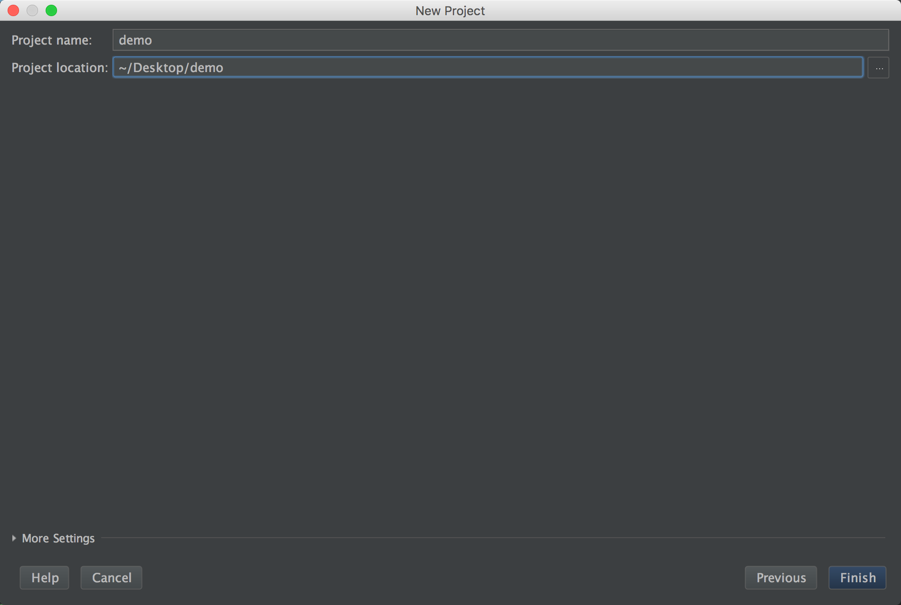

# 1 起步

* Spring 1.0，改变了企业级Java应用开发。依赖注入和声明式事务。
* Spring 2.0，自定义XML命名空间。
* Spring 2.5，面向注解的依赖注入模型，@Component和@Autowired，以及Spring MVC编程模型。无需显式声明组件，无需继承一些基础控制器类。
* Spring 3.0，全新的基于Java的配置方式，从Spring 3.1开始的@Enable打头的注解，去XML化。
* Spring 4.0，条件配置，运行过程中可以根据类路径，环境等因素觉得哪些配置生效，哪些配置忽略。

## 1.1 魔力

假设我们要写一个非常简单的Hello World Web应用，至少需要以下这些东西：

* 项目结构，Maven或者Gradle，至少需要依赖Spring MVC和Servlet API
* 在web.xml（或者WebApplicationInitializer实现）中声明Spring的DispatcherServlet
* Spring MVC配置
* 一个Controller，响应“Hello World”
* 一个Web服务器，如Tomcat

以上这么多点中，其实只有Controller才是我们关心的代码，其他的都是一些无聊的模板式的代码，多数Web应用都会用到。

看看Spring Boot怎么写：

```
@RestController
class HelloController {
  
  @RequestMapping("/")
  def hello() {
    return "Hello World"
  }
}
```

没有配置，没有web.xml，也没有构建脚本，甚至没有server，如果你安装了CLI，你就可以这么运行：

```
spring run HelloController.groovy
```

## 1.2 特性

Spring Boot并非一种全新的框架，而是在Spring的基础之上，提供了开发Spring应用程序的更便捷的方法。

### 1.2.1 Auto Configuration

如果你要用JDBC访问关系型数据库，就需要配置一个JdbcTemplate，像这样：

```
@Bean
public JdbcTemplate jdbcTemplate(DataSource dataSource) {
  return new JdbcTemplate(dataSource);
}

@Bean
public DataSource dataSource() {
  return new EmbeddedDatabaseBuilder()
          .setType(EmbeddedDatabaseType.H2)
          .addScripts('schema.sql', 'data.sql')
          .build();
}
```

为了访问个数据库，每次都要自己配置这样的Bean，太烦了，Spring Boot的自动配置机制非常棒，当它发现项目中有H2依赖包，它自动给你配置一个H2的DataSource，当它发现JdbcTemplate在类路径下，自动给你配置一个JdbcTemplate，并且会帮你自动注入，你就不用自己配置上面两个Bean了，直接拿来用就好了。

### 1.2.2 Starter Dependencies

每次写代码，依赖是个很头疼的事情，我需要什么包？group和artifact是啥？该用哪个版本？会不会与别的包不兼容？

通过Spring Boot的starter包，借助于Maven或Gradle的传递性依赖特性，你想实现某些功能，直接引入对应功能的starter包就行了，相关的依赖都会引入进来，而且这些starter包的依赖版本都是经过严格测试的，保证版本兼容性不会出现问题。

比如你想写一个web应用，直接引入“web” starter（org.springframework .boot:spring-boot-starter-web），如果你需要security，直接引入“security” starter，所有相关的依赖都会引入进来。

### 1.2.3 The Command-Line Interface（CLI）

上面1.1中的HelloController都没有import语句，那是因为CLI检测到RequestMapping和RestController，它知道它们来自哪些starter，CLI就会引入这些starter，并且自动配置会生效，所以就可以如此简单。

### 1.2.4 The Actuator

如果说前面的三个特性都是方便开发的，那么这个东西就是方便监控应用运行的了，通过Actuator，可以看到比如下面这些信息：

* 配置了哪些Bean以及它们之间的依赖关系
* 自动配置做了哪些决策
* 环境变量，系统属性，配置属性，命令行参数等
* 当前各种线程的状态
* 近期的HTTP请求
* 各种指标比如内存使用，垃圾回收，网络请求，数据源使用情况等

可以通过web路径或者shell命令查看（SSH）。

## 1.3 误解

Spring Boot不是一个应用服务器，虽然通过Spring Boot你可以构建一个可执行的jar包（web应用），那是通过内置Servlet容器来实现的（Tomcat，Jetty，Undertow），而不是Spring Boot本身提供的。

Spring Boot不实现任何的Java标准，比如JPA或JMS，它只是通过自动配置实现这些标准的Bean来实现这些功能的。

Spring Boot不生成任何代码。

Spring Boot就是Spring，它只是帮你做了本来需要你手工去做的事情。

## 1.4 动手

### 1.4.1 安装CLI

**1. 手工安装**

下载下面任意一个

* [spring-boot-cli-1.3.5.RELEASE-bin.zip](http://repo.spring.io/release/org/springframework/boot/spring-boot-cli/1.3.5.RELEASE/spring-boot-cli-1.3.5.RELEASE-bin.zip)
* [spring-boot-cli-1.3.5.RELEASE-bin.tar.gz](http://repo.spring.io/release/org/springframework/boot/spring-boot-cli/1.3.5.RELEASE/spring-boot-cli-1.3.5.RELEASE-bin.tar.gz)
 
下完解压，把bin路径加到环境变量PATH中即可（需要注销再登录），然后命令行运行：
```
spring --version
```
检查是否安装成功。对于Windows用户貌似就这一种方法。

**2. SDKMAN安装（推荐）**

安装SDKMAN（The Software Development Kit Manager）

```
curl -s get.sdkman.io | bash
source ~/.sdkman/bin/sdkman-init.sh
```

安装CLI

```
sdk install springboot
```

列出所有版本

```
sdk list springboot
```

安装特定版本

```
sdk install springboot 1.3.5.RELEASE
```

指定使用某版本

```
sdk use springboot 1.3.5.RELEASE
```

设置默认版本

```
sdk default springboot 1.3.5.RELEASE
```

**3. OS X Homebrew安装**

```
brew tap pivotal/tap
brew install springboot
```

Homebrew会把CLI安装到/usr/local/bin路径下面。

**4. OS X MacPorts安装**

```
sudo port install spring-boot-cli
```

MacPorts会把CLI安装到/opt/local/share/java/spring-boot-cli路径下面，并在/opt/local/bin下面创建符号链接。

### 1.4.2 Spring Initializer

Spring Initializer就是一个Web应用，你可以用它生成一个Spring Boot项目的骨架（Maven或Gradle），有几种使用方法：

* [通过网页](http://start.spring.io)（很简单，略）
* Spring Tool Suite（基于Eclipse，还是用IDEA吧）
* IntelliJ IDEA（推荐）
* Spring Boot CLI（推荐）

打开IDEA，选择File > New > Project，出来下图

 

点击Next，



这里做一些基本配置，点击Next，



这里选择你要的功能（依赖），其实就是starter依赖包，常用的比如Security、Web、JPA、MySQL等，点击Next，



最后填写项目名称和路径，点击Finish，一个项目骨架就生成并导入IDEA了。

